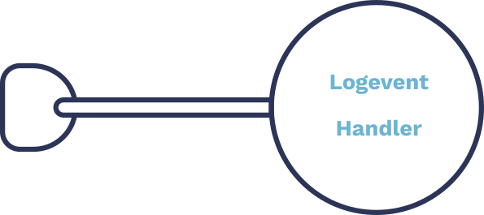

## Sensu-Plugins-Logs



Store a JSON representation of the most recent Sensu events in a dedicated directory structure using the handler-logevent.rb handler command.

References:

* [Plugin Repository](https://github.com/sensu-plugins/sensu-plugins-logs/)
* [Gem Homepage](https://rubygems.org/gems/sensu-plugins-logs)

### Prerequisites

#### Plugin Installation
You'll want to make sure your sensu server has the sensu-plugins-logs ruby gem installed. If you are using the embedded ruby environment provided by the official Sensu 1.x packages, all you can use `sensu-install -p logs` to install the plugin into the embedded ruby  environment.  If you are using a different ruby environment, you can use `gem install sensu-plugins-logs` to install the gem.


### Plugin Executables

#### handler-logevent.rb
This ruby executable is usable as a Sensu 1.x pipe handler

The handler requires a `logsevent` settings configuration with `eventdir` and `keep` defined
```
{
  "logevent": {
    "eventdir": "/var/log/sensu/events",
    "keep": 10
  }
}

```

Here is a handler definition that makes use of the configuration defined above.
```
{
  "handlers": {
    "logs_test_handler": {
      "type": "pipe",
      "command": "handler-logevent.rb"
    }
  }
}

```

If you have your executable environment configured to include the path in which the plugin executables were installed, you can test this minimal configuration by executing the handler on the commandline by injecting the json representation of a sensu event via a pipe.

```
echo '{ "action" : "create" , "check" : { "output" : "test warning output", "name" : "logs_test_check", "status" : 1, "executed": "1532132894"} , "client" : {"address" : "unknown","subscriptions" : ["logs_test"], "name" : "logs_test_client" } }' | handler-logevent.rb
```

Running this echo pipe should result in an event log at `/var/log/sensu/events/logs_test_client/logs_test_check/1532132894.create`

The the full path of the logged events is constructed using the `eventdir` value in the `logevent` configuration, the client name, the check name, the execution time of the check, and the event action.   The handler will prune the number of events, matching each action for each check, using the `keep` value in the `logevent` configuration.


